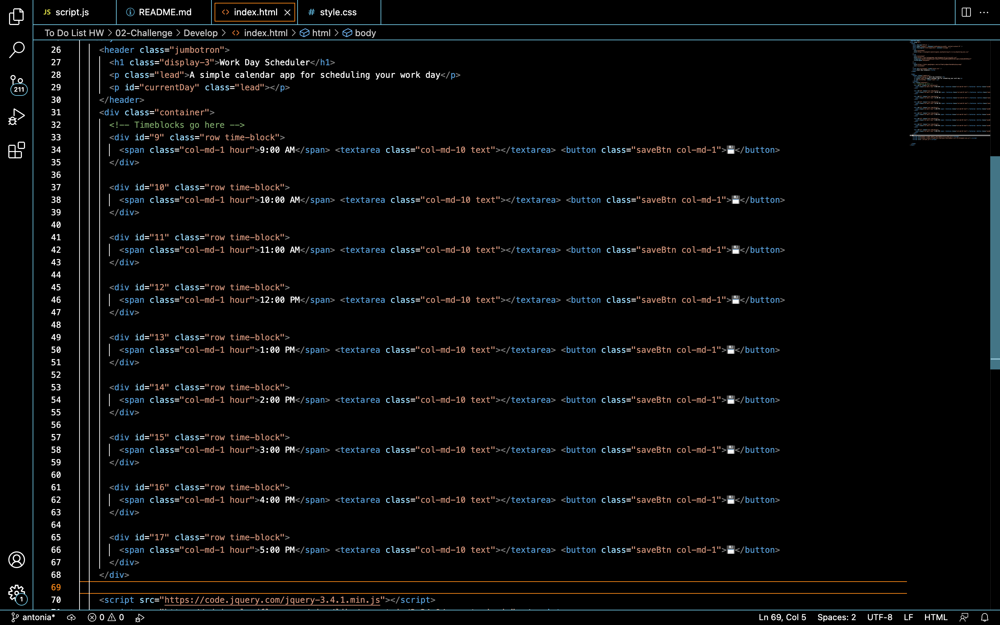
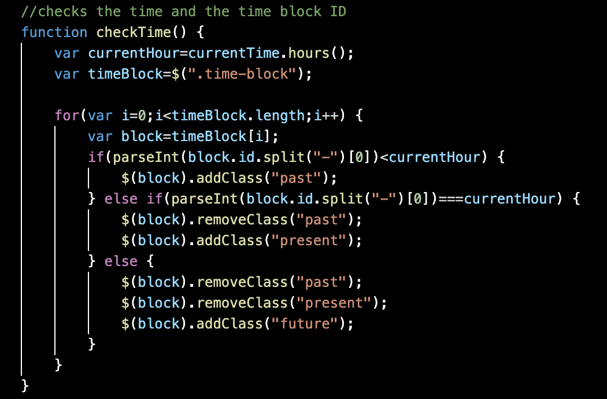
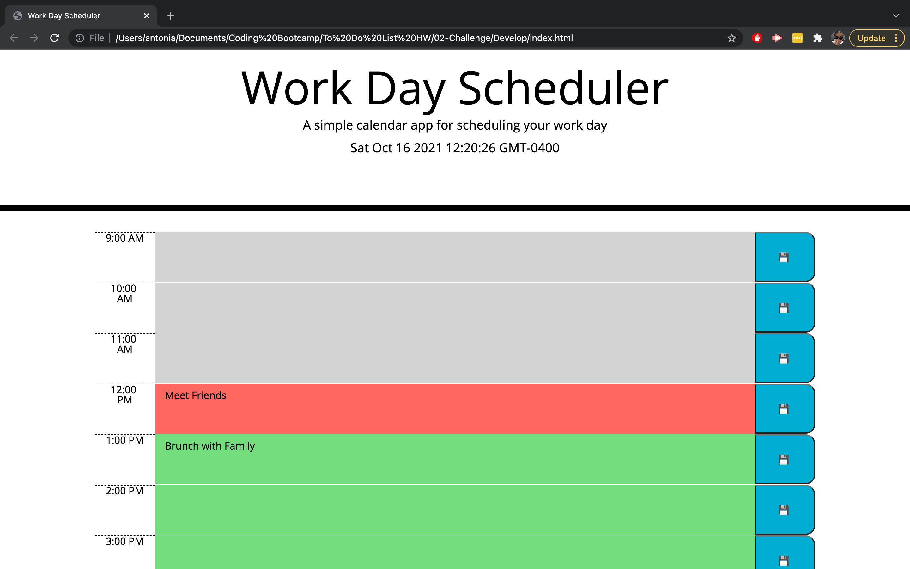

# Work Day Scheduler

Create a simple calendar application that allows the user to save events for each hour of the day. This app will run in the browser and feature dynamically updated HTML and CSS powered by jQuery.

The starter code uses the [Moment.js](https://momentjs.com/) library to work with date and time, but you're free to use a different JavaScript solution to handle this functionality because Moment.js is considered a "legacy" product. Learn more about these other solutions in the [Moment.js project status page.](https://momentjs.com/docs/#/-project-status/).

## User Story

```
AS AN employee with a busy schedule
I WANT to add important events to a daily planner
SO THAT I can manage my time effectively
```
## My Work Day Scheduler

[Here is the link to my deployed scheduler](https://iviviana.github.io/workday-scheduler/)

I stuck to using moment.js for this project instead of using a different library like LUXON. In the HTML portion I used div elements assigned as the time blocks, that will contain and load the saved data.




In the Javascript code, I made a time checking function that contained a for loop that would assign a class to each div element based on the current hour. This will then change the color of the text area to reflect if the time is in the past, future, or present.



The scheduler now appears as below, it saves the data to the users local storage and will display the values, even if the page is refreshed.




## Contributers
[Antonia Garcia](https://github.com/Iviviana)


